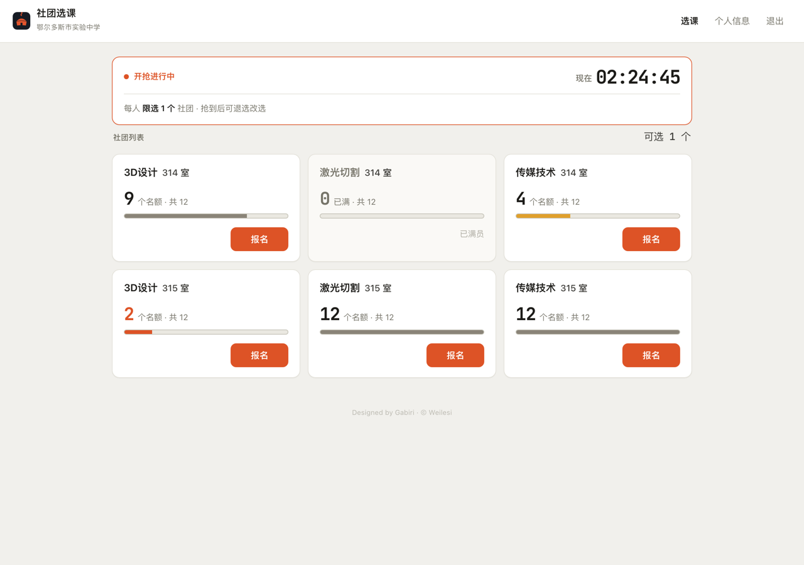

<div align="center">

# 社团选课系统 · OMMS-STXK

面向中学的**社团抢课**系统:开抢时间一到,几百名学生同一秒抢有限名额 —— **零超卖、一人一社、手机优先**。

[](LICENSE)


<sub>为 <b>鄂尔多斯市实验中学</b> 而做</sub>


</div>

## 它能做什么

- **扛得住开抢瞬间的并发** —— 一个年级几百人同一秒点"报名",名额满了自动停,**绝不超发**(不会把 12 人的社团塞进 13 个)。
- **学生端** —— 醒目倒计时、实时剩余名额、一键报名;抢到可退选改选,一人始终一社。手机、电脑都好用。
- **管理端** —— 粘贴导入名单、建社团设名额、定开抢时间、实时看各社团进度与未报名名单、一键导出。
- **稳与安全** —— Redis 原子抢占防超卖、argon2 口令、服务端会话、首启随机管理员口令、边缘限流。

<div align="center"></div>

## 快速开始

```bash
git clone https://github.com/KeikaJames/OMMS-STXK.git
cd OMMS-STXK
pip install redis argon2-cffi pypinyin   # 可选;缺了也能降级单机跑
python3 main.py                          # 打开 http://127.0.0.1:2001
```

首次启动会在**运行窗口打印一行随机管理员密码**(`初始密码 ...`),抄下、登录、尽快改用。

需要完整双服务(nginx 限流 + Rust 热服务 + Redis)时,一键编排:

```bash
bash run.sh                              # 打开 http://127.0.0.1:8080
```

## 怎么用

**老师 / 管理员**:登录(切到"管理员")→ 导入学生名单(系统自动生成账号密码,**导入时一次性显示,请当场导出下发**)→ 建社团、设名额 → 设开抢时间 → 开抢后实时看进度、导出报名表。

**学生**:用老师发的账号登录 → 到点在想去的社团点"报名" → 在"个人信息"里查看或退选改选。

## 部署与安全(上线前必读)

- **生产必须启用 HTTPS**:自带的 `nginx.conf` 是开发用明文 8080,正式上线改 443 + TLS,否则密码明文过网。
- **初始密码一次性下发**:管理员密码首启打印在运行窗口一次,学生密码导入时一次性返回——都请当场保存,遗失需重置或重新导入(系统不长期保存明文)。
- **校园限流**:全校共用一个出口 IP 时,边缘限流可能偏紧,按规模调高或加白名单;真正防超卖在应用层。
- **数据不入库**:`club_system.db` 等运行数据已被 `.gitignore` 排除。

## 项目结构

```
main.py        Python 管理面 + 抢课后备(只用标准库 + SQLite)
club-hot/      Rust 热服务(axum + Redis 原子抢占,可选)
web/           前端(纯 HTML/CSS,无构建步骤)
nginx.conf     边缘限流 / 静态 / 路由     run.sh  一键编排
```

## 参与贡献

欢迎 PR。本项目**只接受 Pull Request,禁止直推 `main`**,并有代码风格约定 —— 动手前请读 [CONTRIBUTING.md](CONTRIBUTING.md)。

## 作者与许可

在 **WEILESI(https://github.com/vles0123)** 的原始版本基础上,由 **BIRI GA([KeikaJames](https://github.com/KeikaJames))** 经原作者授予后强化改造(并发防超卖、安全加固、界面重做),以 **[Apache License 2.0](LICENSE)** 分发,署名见 [NOTICE](NOTICE)。
