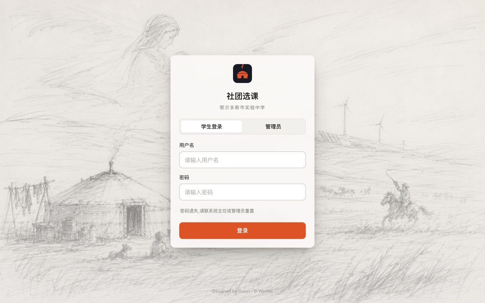
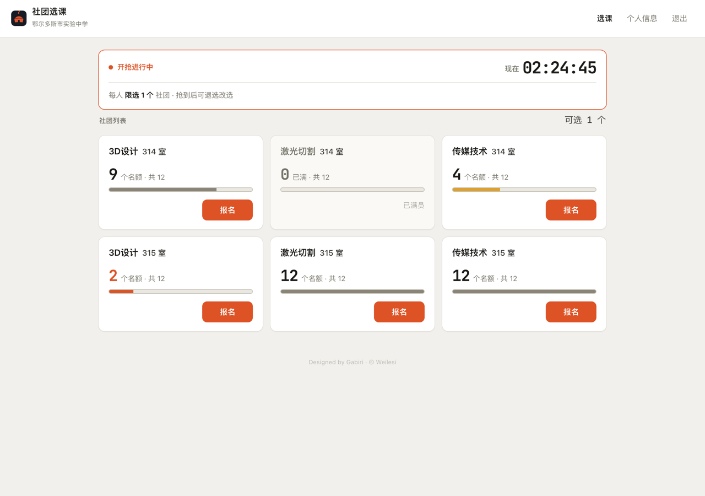

<div align="center">

# 社团选课系统 · OMMS-STXK

开抢时间一到,一个年级几百名学生在同一秒争抢有限的社团名额。这是一套为这种场景写的选课系统。

[](LICENSE)


<sub>为 <b>鄂尔多斯市实验中学</b> 而做</sub>



</div>

## 这是一个秒杀问题

抢课的难点不在功能多,而在那一瞬间的并发。一个 30 人的社团,可能有 300 人同时点"报名"。系统要做的事只有一件,但必须做对:在所有人里挑出前 30 个,一个不多——不能把 30 人的社团塞进 31 个人。

把这件事做对,是这套系统的全部设计意图。下面讲它是怎么做到的,以及怎么用。

## 怎么实现的

**热计数在 Redis,最终容量底线在 SQLite。** 每个社团的实时剩余名额是 Redis 整数键 `stock:club:{id}`,用来在开抢瞬间快速挡住满员请求。SQLite 保存最终报名记录；数据库另有 `registrations_capacity_guard` 触发器,会独立拒绝第 `max + 1` 条记录。因此即便 Redis 因故障或运维操作发生漂移,也不能把超卖真正写进数据库。`clubs.current_students` 只是管理后台使用的派生镜像。

**抢占是一段 Lua 脚本,在 Redis 里一步完成。** 报名请求到达时,服务端不是先查询、再判断、再扣减——那样会在两步之间留下缝隙,让两个人同时看到"还剩 1 个"。它把整个判断交给一段 Lua,Redis 单线程逐条执行,中途不会插进别的请求:

```lua
if redis.call('EXISTS', KEYS[5]) == 1 then return -3 end   -- 维护中
local open_at = redis.call('GET', KEYS[4])
if not open_at or tonumber(redis.call('TIME')[1]) < tonumber(open_at) then
  return -4                                                  -- 尚未开放
end
if redis.call('EXISTS', KEYS[1]) == 0 then return -2 end   -- 名额状态缺失,拒绝猜测恢复
if redis.call('EXISTS', KEYS[2]) == 1 then return -1 end   -- 已确认报名
if redis.call('EXISTS', KEYS[3]) == 1 then return -1 end   -- 已有在途占位
if redis.call('EXISTS', KEYS[6]) == 1 then return -1 end   -- 同一学生有最终化任务
local left = tonumber(redis.call('GET', KEYS[1]))
if left <= 0 then return 0 end                             -- 满员
redis.call('SET', KEYS[3], ARGV[1], 'EX', tonumber(ARGV[2]))  -- club_id|operation_id
redis.call('SET', KEYS[6], ARGV[1], 'EX', tonumber(ARGV[3]))  -- 跨服务 operation lease
redis.call('DECR', KEYS[1])                                -- 最后扣一个名额
return 1                                                    -- 抢到
```

"检查维护/开放时间 → 查重 → 看余量 → 扣减 → 占位"在一个 Lua 脚本里完成。两个人不可能同时扣到最后一个名额:Redis 让其中一个先跑完,另一个再跑时 `left` 已是 0。SQLite 的 `UNIQUE(student_id)` 又为"一人一社"提供了持久层保护。

**抢到之后,用操作代际完成或补偿。** 每次报名生成唯一 `operation_id`,`resv:{student}`、`seat:op:{student}` 和确认态都关联同一代操作。确认、失败回补、退选分别使用 CAS/幂等 Lua,旧请求不能在延迟后误删新报名或重复归还座位。Rust 先取得 finalizer 槽位,再把 acquire、SQLite 落库和 Redis 最终化整体放进独立任务；客户端断开或外层超时不会取消该任务。Redis 命令有内部 deadline,同 operation 可安全重试；仍失败时,后台会等所有 operation lease 排空后取得 maintenance fence 做一致快照对账。预留 TTL 默认 60 秒；TTL 本身不会凭空归还库存。

**两个服务,一套键。** 管理后台用 Python 写(`main.py`),抢课热路径用 Rust 写(`club-hot/`,axum + 有界 Redis/SQLite 连接池)。两者共享 Redis 键、CAS Lua、SQLite 容量触发器和 operation ID。最外层 nginx 直接发送静态资源,按 session 限制狂点，并叠加不依赖 Cookie 真实性的源 IP 热路径桶；把六个热端点转给 Rust,其余转给 Python。Python 可以在 Rust 连接失败时维持低容量降级服务,但它不是与 Rust 等价的高并发副本。

**会话也有代际。** Python 和 Rust 都只接受恰好一个 `session` Cookie；重复 cookie 一律拒绝，避免两个后端选中不同身份。每个账号只保留最近一次登录对应的有效会话；再次登录、改密码、删除学生或清空学生都会立即使旧 token 失效。改密/删除期间会话创建还会被 Redis mutation lock 暂停，防止旧密码在 SQLite 提交前抢到“新代际” token。部署这套协议时必须同时切换 Python 与 Rust；已有旧 token 会被要求重新登录一次。

**代价说在前面。** 单机进程若在 Redis 已扣减、SQLite 尚未记录的极窄窗口被强杀,仍可能暂时少卖一个；数据库容量触发器保证这种故障不会反向变成超卖。Python 启动时会先取得跨服务 maintenance fence,确认没有在途报名/退选后才安全对账；拿不到 fence 就保留 live Redis、不覆盖。对于需要多机、多地域和掉电后自动恢复的部署,还应增加持久 outbox/队列与可查询的请求幂等键。

## 怎么用

**管理员**(`/admin/dashboard`,登录时切到"管理员"):

1. **导入学生名单**——粘贴或上传(姓名、班级、学号)。系统为每人生成账号和随机密码,**这批密码只在导入完成时显示这一次**,请当场导出、线下发给学生。
2. **建社团、设名额**——逐个建,或批量导入(社团名 + 容量)。
3. **设开抢时间**——到这个时间点之前,后端拒绝一切报名;到点自动放行。
4. **开抢后**——实时看各社团报名进度、导出报名表、导出未报名名单、按社团下载名册。学生账号密码表也在这里导出。

**学生**(`/student/dashboard`):用老师发的账号登录,页面有倒计时和每个社团的实时余额。到点点"报名";已报名的可以在"个人信息"里退选、改选——始终一人一社。为降低 token 泄露后的风险，同一账号在另一台设备重新登录会使前一台设备退出。

<div align="center"></div>

## 跑起来

单机起 Python 一个进程可以用于开发和小规模，但登录、报名和退选仍需要 Redis server；`redis` 客户端包与 `argon2-cffi` 是完整/安全运行所需，`pypinyin` 用于更好的账号生成。若管理员要上传社团 JPEG/PNG/WebP/GIF 图片，还需安装 `Pillow`：

```bash
brew services start redis                # macOS 示例；其他系统用各自服务管理器
redis-cli ping                           # 必须返回 PONG
pip install redis argon2-cffi pypinyin Pillow
python3 main.py                          # 打开 http://127.0.0.1:2001
```

首次启动会在运行窗口打印一行随机管理员密码,抄下、登录、尽快改掉。

要完整的双服务(nginx 限流 + Rust 热路径 + Redis),一键编排:

```bash
bash run.sh                              # 打开 http://127.0.0.1:8080
```

`run.sh` 会先在旧入口仍在线时完成 Rust 构建、Redis 与 nginx 配置预检；构建失败会保留旧站点。预检通过后才摘流、等待在途报名/退选排空、启动 Python(:2001)并安全对账，再启动当前源码的 Rust(:2002)和 nginx(:8080)。新 Rust 未通过 readiness 时会明确改用低容量 Python backup。

## 管理运营接口

管理员可以在界面中使用以下能力；新增的单项重置、社团编辑、图片和手工调剂动作要求原因与前端生成的请求 ID，并写入 append-only 审计事件：

- 重置单名学生密码：旧 session 立即撤销，临时密码只在首次响应中显示一次。
- 更新社团名称、容量、描述、指导老师、时间地点、年级/班级限制与启用状态。容量变化在 maintenance fence 下用定向 Redis 更新处理；若发布中断，仅对应社团会短暂显示“名额同步中”，正常路径不会触发全量库存对账。
- 手工加入、移出或转移学生报名。普通调剂仍遵守容量和资格限制；如需越过资格限制，管理员必须显式标记并说明原因，容量不会被绕过。
- 查看分页审计历史与固定 60 秒的运行快照；快照只显示聚合 QPS、状态码、上游分布、限流计数和名额状态，不泄露请求日志、IP、Cookie 或密码。
- “预演压测”页面只提供隔离 CLI 命令与最近结果说明；网页不会启动进程或对运行中的数据库、Redis、8080 服务发压。

## 高并发验证

仓库自带完全隔离的 Rust 压测器：每轮创建临时 SQLite、随机非 6379 的 Redis 端口和独立学生 session,结束后自动清理。它不只看 HTTP QPS,还同时检查业务成功数、DB 容量、`current_students`、Redis stock、确认代际和残留 reservation：

```bash
cargo build --release --manifest-path club-hot/Cargo.toml
python3 tests/stress_registration.py --seats 100 --users 1000 --concurrency 300
python3 -m unittest discover -s tests -p 'test_python_races.py' -v
python3 -m unittest tests.test_edge_security -v
```

Rust 默认总在途上限已按实测从 512 调整为 1024。本机让 `1000` 名独立学生真正同时争 `100` 个名额的收尾三轮中,每次都恰好 `100` 个成功、`900` 个满员、无 HTTP/传输错误；完成吞吐中位数约 `3064 req/s`,p99 中位数约 `237 ms`,16 项 SQLite/Redis/operation lease 不变量全部通过。这些数字只能说明本机容量余量，不能当生产尾延迟承诺；上线前仍要在真实服务器、校园 NAT、TLS 和混合轮询下复测。

更重的“1000 并发、1000 次都必须真正写 SQLite”场景收尾三轮也全部成功、零状态漂移：完成吞吐中位数约 `1781 次报名/秒`,p99 中位数约 `470 ms`，三轮都在约 `0.54–0.65 s` 内完成全部 1000 次写入。

## 上线前

- **生产必须开 HTTPS。** 自带的 `nginx.conf` 是开发用的明文 8080;正式部署改 443 + TLS，并设置 `COOKIE_SECURE=1`，否则密码明文过网、Cookie 也不能标记为 `Secure`。HTTP 环境不应配置 HSTS。
- **初始密码一次性下发。** 管理员密码首启打印一次,学生密码导入时返回一次——系统不长期保存明文,丢了只能重置或重新导入。
- **校园出口不能作为学生身份。** 全校常共用一个公网 IP；认证后的报名与轮询按真实会话限速，Nginx 还用源 IP 桶阻挡伪造随机 Cookie 的绕过。应用层不再因共享 IP 的失败登录计数锁死全校；仍需按真实学生数复测边缘 burst。
- **安全回归记录。** 本轮请求 framing、Cookie、会话撤销、导入边界、Nginx 响应头和边缘限流的修复与隔离验证见 [security-remediation-2026-09-03](docs/security-remediation-2026-09-03/task_plan.md)。

## 项目结构

```
main.py        Python 管理后台 + 热路径后备(标准库 + SQLite)
club-hot/      Rust 热服务(axum + Redis,可选)
web/           前端(纯 HTML/CSS,无构建步骤)
nginx.conf     边缘限流 / 静态 / 路由        run.sh  一键编排
```

## 参与贡献

欢迎 PR。本项目只接受 Pull Request、不直推 `main`,并有代码风格约定——动手前请读 [CONTRIBUTING.md](CONTRIBUTING.md)。

## 作者与许可

在 **Vles0123** 的原始版本之上,由 **BIRI GA([KeikaJames](https://github.com/KeikaJames))** 经原作者授权强化改造(并发抢占、安全加固、界面重做),以 [Apache-2.0](LICENSE) 分发,署名见 [NOTICE](NOTICE)。
